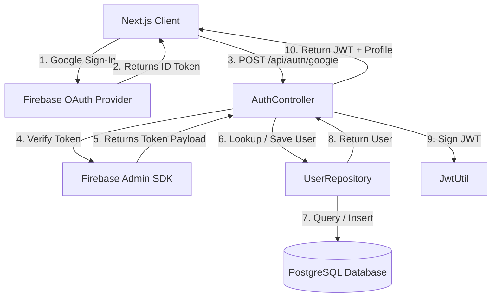

# Alumni Hub 🎓

[](https://github.com/sasikiransrinivasdulla/AlumniHub)
[](LICENSE)
[](https://www.oracle.com/java/)
[](https://nextjs.org/)

Alumni Hub is an enterprise-grade social networking platform built exclusively for university alumni. By utilizing robust identity verification via Google OAuth and Firebase, it provides classmates with a secure, private community where they can reconnect, share experiences, and network.

---

## 🚀 Features

### Current (v1.2.0 - Onboarding & Memories Feed)
* **Alumni Memories Feed**: Exposes REST APIs (`POST /api/posts`, `GET /api/posts/feed`, and `GET /api/posts/{id}`) to share and browse memories.
* **Community-Based Visibility Restrictions**:
  - `CST` and `ECT`: Feed is visible strictly to users matching Batch + Department.
  - `CSE`, `ECE`, `EEE`, `MECH`, `CIVIL`, `AIML`, `CAI`: Feed is visible strictly to users matching Batch + Department + Section.
  - Direct detail requests (`GET /api/posts/{id}`) return `403 Forbidden` if user is outside the author's community.
* **Secure Google Sign-In**: Powered by Firebase client authentication popup.
* **Backend Verification**: ID Tokens are verified server-side using the Firebase Admin SDK to ensure security.
* **Automatic User Provisioning**: Searches PostgreSQL for existing accounts; automatically provisions new user profiles.
* **Modern JWT Authentication**: Custom signed application JSON Web Tokens (JJWT 0.12.6) for subsequent requests.
* **User Profile Management**: REST API endpoints (`GET /api/user/me` and `PUT /api/user/me`) with custom Spring validations (exact 10-digit phone, max 250-character bio, LinkedIn, GitHub, and Instagram URLs validation).
* **Branch-Based Conditional Validation**: GitHub profile URL is conditionally required for software-related branches (`CSE`, `CST`, `AIML`, `CAI`) and optional for all other branches.
* **Mandatory First-Time Setup**: Automatic routing redirect logic locking dashboard access until users submit graduation details.
* **Dynamic Dropdown Selectors**: Department-based Section options (e.g. CSE -> A/B/C/D, CST -> No Section).
* **Responsive B&W Memories Dashboard**: Split-column layout displaying user info card next to recent community memories feed, with a "Share a Memory" submission modal.

### Planned Community Features
* **Classmate Directories**: View contact information restricted only to classmates within the same Batch + Department + Section.
* **Likes & Comments**: Interactive features for posts in the feed.
* **Cloudinary Image Uploads**: High-performance image hosting for posts and profile pictures.

---

## 🛠️ Tech Stack

### Frontend
* **Framework**: Next.js 16 (App Router)
* **Language**: TypeScript
* **Styling**: Tailwind CSS
* **Authentication**: Firebase Client SDK

### Backend
* **Framework**: Spring Boot 3.3.4
* **Language**: Java 21
* **Database**: PostgreSQL (Neon Serverless DB)
* **Security**: Spring Security & Custom JWT Filters
* **Verification**: Firebase Admin SDK
* **Utilities**: Lombok, Jackson

---

## 📐 Project Architecture



For a deeper dive into packages and state flow, refer to [docs/architecture.md](docs/architecture.md).

---

## 📂 Folder Structure

```
AlumniHub/
├── backend/                   # Spring Boot 3 Backend
│   ├── src/
│   │   ├── main/
│   │   │   ├── java/com/alumnihub/
│   │   │   │   ├── config/    # Third-party beans (FirebaseConfig)
│   │   │   │   ├── controller/# REST Controller layer (AuthController)
│   │   │   │   ├── dto/       # Data Transfer Objects
│   │   │   │   ├── entity/    # JPA Entities (User)
│   │   │   │   ├── repository/# JpaRepositories (UserRepository)
│   │   │   │   ├── security/  # Filters & WebSecurity configs (JwtFilter)
│   │   │   │   └── service/   # Business logic (AuthService)
│   │   │   └── resources/     # Properties & application config
│   │   └── test/              # Integration & Unit test suite
│   ├── pom.xml                # Maven Dependencies
│   └── .env.example           # Backend config template
│
├── frontend/                  # Next.js 16 Frontend
│   ├── app/                   # Next.js App Router (Page views)
│   ├── components/            # Reusable UI elements
│   ├── lib/                   # Integrations (firebase.ts)
│   ├── services/              # API and storage clients
│   ├── package.json           # Frontend dependencies
│   └── .env.example           # Frontend config template
│
└── docs/                      # Technical Documentation
```

---

## 🔐 Environment Variables

Before starting locally, configure your environment variables.

### Frontend (`frontend/.env.local`)
Copy `frontend/.env.example` to `frontend/.env.local` and fill in:
* `NEXT_PUBLIC_API_URL`: Path to backend server (e.g., `http://localhost:8080`).
* Firebase Web Config variables (`API_KEY`, `AUTH_DOMAIN`, etc.).

### Backend (`backend/.env`)
Copy `backend/.env.example` to `backend/.env` and fill in:
* `DATABASE_URL`: Connection string to PostgreSQL.
* `JWT_SECRET`: Base64-encoded signing key.
* Firebase Admin JSON parameters (`PROJECT_ID`, `CLIENT_EMAIL`, `PRIVATE_KEY`).

---

## 💻 Local Setup & Running

### Prerequisites
* Java 21 JDK installed
* Node.js v18+ and npm installed
* Running PostgreSQL database instance

### Running the Backend
1. Navigate to the backend directory:
   ```bash
   cd backend
   ```
2. Copy environment properties and configure:
   ```bash
   cp .env.example .env
   ```
3. Run compilation and startup:
   ```bash
   ./mvnw spring-boot:run
   ```
   The backend starts on `http://localhost:8080`.

### Running the Frontend
1. Navigate to the frontend directory:
   ```bash
   cd frontend
   ```
2. Copy environment properties and configure:
   ```bash
   cp .env.example .env.local
   ```
3. Install dependencies:
   ```bash
   npm install
   ```
4. Run development server:
   ```bash
   npm run dev
   ```
   Open `http://localhost:3000` to access the application.

---

## 🗺️ Roadmap
- [x] Initial Project Setup (Next.js 16 & Spring Boot 3)
- [x] Complete Google OAuth Authentication (Firebase Admin & JWT)
- [x] Mandatory First-time Profile Setup & Onboarding Flow
- [ ] Classmate restricted directory listing
- [ ] Photo uploads & Cloudinary integration
- [ ] Social Feed (Posts, Comments, Likes)

---

## 📸 Screenshots
*(Screenshots will be added as visual features are integrated).*

---

## 📄 License
This project is licensed under the MIT License - see the LICENSE file for details.

---

## 👤 Author
* **Sasikiran Srinivas Dulla** - *Full Stack Developer* - [GitHub Profile](https://github.com/sasikiransrinivasdulla)
