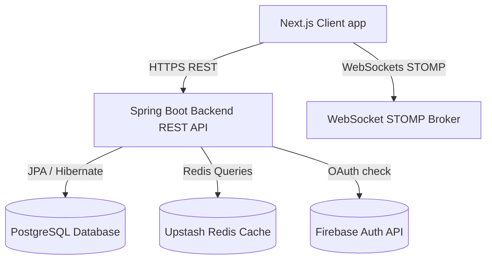
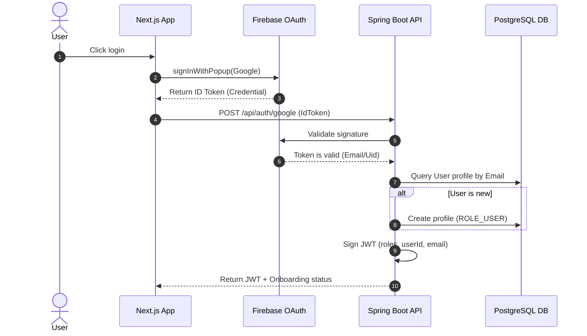
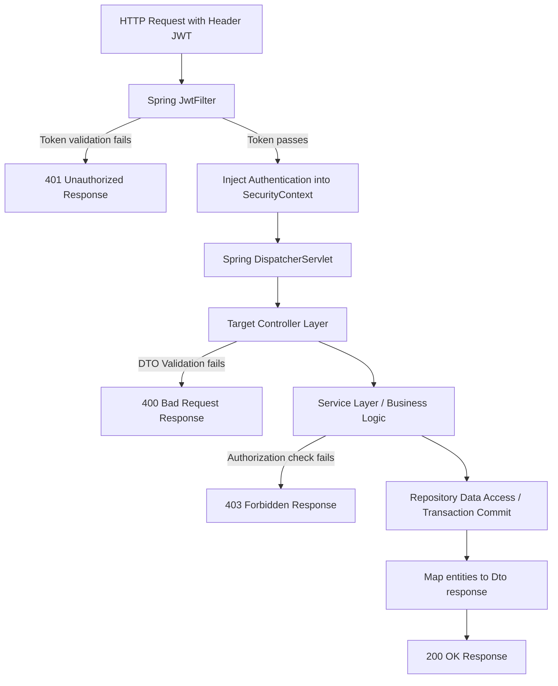

# Enterprise Architecture Blueprint

Alumni Hub is engineered using a decoupled Client-Server architecture. This document serves as the high-level technical blueprint of the platform.

---

## 🏛️ System Overview

- **Frontend client**: A Next.js App Router Single Page Application (SPA) utilizing Tailwind CSS styling and real-time STOMP connection mappings.
- **Backend service**: A Stateless Spring Boot REST API coordinating security configurations, database connections, and event mappings.
- **Cache layer**: Upstash Redis (for server caching) and `requestCache` TTL cache (for client-side UI request caching).

---

## 🔒 End-To-End Authentication Flow

All security operations require token validation. The diagram below details token exchange logic:

---

## ⚙️ Request Lifecycle Flow

Every authenticated HTTP request to the API undergoes a series of validation, authorization, and translation phases:

