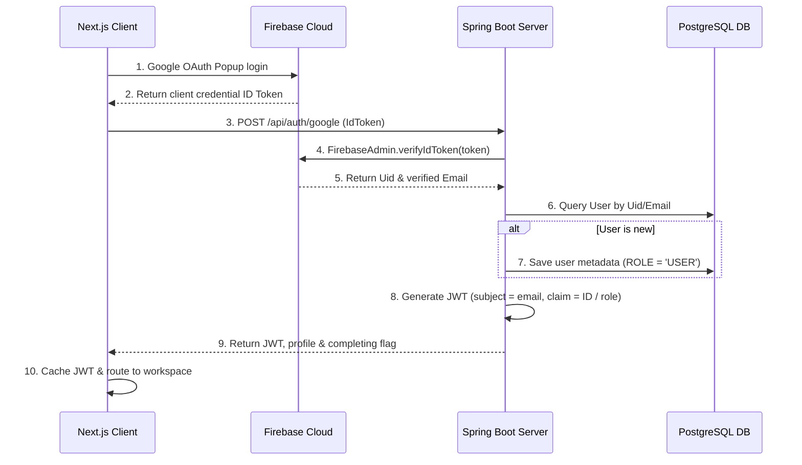

# Authentication & Role Authorization

Alumni Hub coordinates client authentication using Firebase Auth (for provider sign-ins) and Spring Boot custom JWT claims (for session execution and role mapping).

---

## 🔑 Step-by-Step Flow

---

## 🔒 JWT Details
The custom JWT contains authorization claims used to inject user permissions directly into Spring Boot.

### Claims Payload
- **Subject (`sub`)**: User email address.
- **Roles Claim (`roles`)**: User permissions list (e.g. `["ROLE_USER"]`).
- **User ID (`userId`)**: Unique profile database UUID.
- **Expiration (`exp`)**: Configured duration (Default: 7 days).

---

## 🛠️ Server Security Configuration
Spring Security is configured using a custom WebSecurity config:
- **CORS Configuration**: Explicitly permits request headers from Next.js domain.
- **State Management**: Session stateless policy (`SessionCreationPolicy.STATELESS`).
- **Request Permissions**:
  - `/api/auth/**` permitted for anonymous access.
  - `/ws-chat/**` permitted for websocket handshake initialization.
  - All other `/api/**` endpoints require authentication.
- **Filter Chain**: Custom `JwtFilter` checks incoming `Authorization` request headers, verifies JWT signature, and populates `SecurityContextHolder`.
