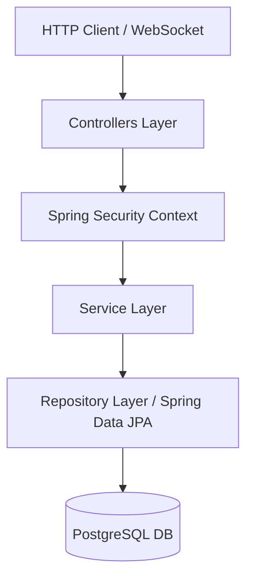
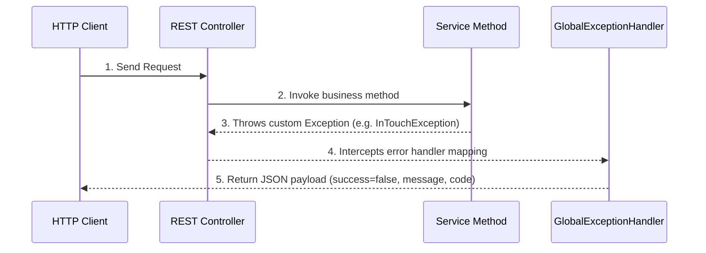

# Backend Architecture & Component Layout

The backend of Alumni Hub is built on Spring Boot 3.3.4, Hibernate, and PostgreSQL. It enforces role-based access control, coordinates real-time STOMP WebSocket messaging, and runs clean transaction blocks.

---

## 🏛️ Layered Component Layout



### 1. Controllers (`com.alumnihub.controller`)
- Exposes standard REST end-points.
- Validates payload schemas using `@jakarta.validation.Valid` validations (e.g. `@NotNull`, `@Size`).
- Delegates business tasks to the Service Layer.

### 2. Services (`com.alumnihub.service`)
- Houses business logic, visibility rules, and transaction boundaries.
- Annotates methods using `@Transactional(readOnly = true)` for data reading optimizations, and `@Transactional` for writes.
- Implements custom security checks. For example, in `JobService`:
  ```java
  if (!job.getCreator().getEmail().equalsIgnoreCase(userEmail)) {
      throw new AccessDeniedException("Not authorized to delete this job.");
  }
  ```

### 3. Repositories (`com.alumnihub.repository`)
- Extends `org.springframework.data.jpa.repository.JpaRepository`.
- Exposes derived queries and custom queries using JPA Query Language (JPQL).

---

## ⚠️ Exception Handling Lifecycle

A global rest controller advice coordinates response formats when things fail:



- **`InTouchException` / Custom Exceptions**: Handled explicitly to return `400 BAD_REQUEST` with structured error messages (codes: `ALREADY_CONNECTED`, `REQUEST_PENDING`, etc.).
- **`AccessDeniedException`**: Returns `403 FORBIDDEN` to prevent data leakage.
- **`IllegalStateException`**: Returns `409 CONFLICT` for operations conflicting with the current entity state.
- **Standard Fallback**: Generic `Exception.class` handler logs the stack trace and outputs `500 INTERNAL_SERVER_ERROR` with a safe message: `"Something went wrong. Please try again."`.
