# Database Schema & Relationship Documentation

This document describes the PostgreSQL database schema for the Alumni Hub ecosystem. All entities are mapped using JPA/Hibernate.

---

## 📊 Entity Relationship Diagram

```mermaid
erDiagram
    users ||--o{ posts : "creates"
    users ||--o{ comments : "writes"
    users ||--o{ likes : "gives"
    users ||--o{ notifications : "receives"
    users ||--o{ contact_requests : "sends/receives"
    users ||--o{ in_touch_connections : "establishes"
    users ||--o{ events : "organizes"
    users ||--o{ event_participants : "joins"
    users ||--o{ timeline_entries : "creates"
    users ||--o{ job_openings : "posts"
    users ||--o{ job_bookmarks : "bookmarks"
    users ||--o{ achievements : "publishes"
    users ||--o{ profile_view_logs : "views/is_viewed"
    users ||--o{ referrals : "creates"
    users ||--o{ referral_requests : "requests"
    users ||--o{ reunion_attendees : "attends"
    users ||--o{ reunion_media : "uploads"
    users ||--o{ reunion_comments : "writes"
    users ||--o{ user_certifications : "has"
    users ||--o{ user_educations : "has"
    users ||--o{ user_experiences : "has"
    users ||--o{ user_projects : "has"
    users ||--o{ mentorship_requests : "mentors/mentees"
    
    posts ||--o{ comments : "contains"
    posts ||--o{ likes : "receives"
    
    conversations ||--o{ messages : "contains"
    users ||--o{ messages : "sends"
    
    reunion_collections ||--o{ reunion_media : "contains"
    reunion_collections ||--o{ reunion_comments : "contains"
    
    referrals ||--o{ referral_requests : "receives"
```

---

## 📁 Entity Definitions

### 1. `users` (User Profile Table)
Stores user credentials, academic registration, professional details, privacy settings, and badges.

| Column | Type | Constraints | Description |
|---|---|---|---|
| `id` | `UUID` | `PRIMARY KEY` | Unique identifier. |
| `firebase_uid` | `VARCHAR(255)` | `NOT NULL`, `UNIQUE` | Firebase Auth UID claim. |
| `email` | `VARCHAR(255)` | `NOT NULL`, `UNIQUE` | Email address. |
| `full_name` | `VARCHAR(255)` | `NOT NULL` | Full Name. |
| `profile_picture_url`| `VARCHAR(255)` | - | URL of profile image. |
| `batch` | `VARCHAR(255)` | - | Admission batch year (e.g., 2022). |
| `department` | `VARCHAR(255)` | - | Academic department (e.g., CSE, CST). |
| `section` | `VARCHAR(255)` | - | Department class section (e.g., A, B). |
| `bio` | `TEXT` | - | Self description. |
| `current_position` | `VARCHAR(255)` | - | Job title or student status. |
| `current_company` | `VARCHAR(255)` | - | Employer organization. |
| `current_city` | `VARCHAR(255)` | - | Residing city. |
| `skills` | `VARCHAR(255)` | - | Comma-separated technical skills. |
| `graduation_year` | `VARCHAR(255)` | - | Year of graduation. |
| `privacy_level` | `VARCHAR(255)` | Default: `'PUBLIC'` | Options: `PUBLIC`, `ACADEMIC`, `IN_TOUCH_ONLY`. |
| `phone_number` | `VARCHAR(255)` | - | Mobile contact. |
| `linkedin_url` | `VARCHAR(255)` | - | LinkedIN link. |
| `github_url` | `VARCHAR(255)` | - | GitHub link. |
| `instagram_url` | `VARCHAR(255)` | - | Instagram link. |
| `profile_completed` | `BOOLEAN` | Default: `FALSE` | Signifies onboarding completion. |
| `badges` | `VARCHAR(255)` | - | Comma-separated user badges. |
| `open_to` | `VARCHAR(255)` | - | Hiring/mentorship flags. |
| `mentor_skills` | `VARCHAR(255)` | - | Mentor skill list. |
| `mentor_experience` | `VARCHAR(255)` | - | Mentor years of experience. |
| `mentor_bio` | `TEXT` | - | Mentor description profile. |
| `mentor_active` | `BOOLEAN` | Default: `FALSE` | Mentorship onboarding toggle status. |
| `role` | `VARCHAR(255)` | Default: `'USER'` | Authorization role (`USER` or `ADMIN`). |
| `search_appearances`| `BIGINT` | Default: `0` | Analytics count. |
| `profile_views` | `BIGINT` | Default: `0` | Analytics profile view count. |
| `created_at` | `TIMESTAMP` | `NOT NULL` | Record creation. |
| `updated_at` | `TIMESTAMP` | `NOT NULL` | Record modification. |

* **Indexes**:
  - `idx_users_email` on `email` for fast auth logins.
  - `idx_users_batch_dept_sec` on `(batch, department, section)` for classmate directory searches.

---

### 2. `posts` (Social Memory Feed Table)
Stores user post entries including caption text, media urls, and counts.

| Column | Type | Constraints | Description |
|---|---|---|---|
| `id` | `UUID` | `PRIMARY KEY` | Unique post identifier. |
| `user_id` | `UUID` | `FOREIGN KEY` -> `users(id)` | Author user. |
| `media_type` | `VARCHAR(255)` | `NOT NULL` | Value: `IMAGE` or `VIDEO`. |
| `image_url` | `TEXT` | - | Media URL. |
| `video_url` | `TEXT` | - | Video file reference url. |
| `caption` | `VARCHAR(1000)`| `NOT NULL` | Post text caption (Max 1000 characters). |
| `likes_count` | `INTEGER` | Default: `0` | Likers count. |
| `comments_count` | `INTEGER` | Default: `0` | Thread count. |
| `created_at` | `TIMESTAMP` | `NOT NULL` | Record creation. |
| `updated_at` | `TIMESTAMP` | `NOT NULL` | Record modification. |

---

### 3. `messages` (Chat Messaging Bubble Table)
Stores conversation text and attachments.

| Column | Type | Constraints | Description |
|---|---|---|---|
| `id` | `UUID` | `PRIMARY KEY` | Message ID. |
| `conversation_id` | `UUID` | `FOREIGN KEY` -> `conversations(id)` | Chat room room association. |
| `sender_id` | `UUID` | `FOREIGN KEY` -> `users(id)` | Sender user reference. |
| `text` | `TEXT` | `NOT NULL` | Content block string. |
| `image_url` | `TEXT` | - | Image file attachments. |
| `is_read` | `BOOLEAN` | Default: `FALSE` | Read check. |
| `created_at` | `TIMESTAMP` | `NOT NULL` | Message dispatch time. |

* **Indexes**:
  - `idx_messages_conversation_created` on `(conversation_id, created_at DESC)` for instant scrolling backlogs.

---

### 4. `conversations` (Chat Room Index Table)
Stores unique conversation channels between two users.

| Column | Type | Constraints | Description |
|---|---|---|---|
| `id` | `UUID` | `PRIMARY KEY` | Chat channel ID. |
| `user1_id` | `UUID` | `FOREIGN KEY` -> `users(id)` | First participant. |
| `user2_id` | `UUID` | `FOREIGN KEY` -> `users(id)` | Second participant. |
| `created_at` | `TIMESTAMP` | `NOT NULL` | Record creation. |
| `updated_at` | `TIMESTAMP` | `NOT NULL` | Last message activity time. |

---

### 5. `comments` (Post Thread Comments)
| Column | Type | Constraints | Description |
|---|---|---|---|
| `id` | `UUID` | `PRIMARY KEY` | Comment identifier. |
| `user_id` | `UUID` | `FOREIGN KEY` -> `users(id)` | Author user. |
| `post_id` | `UUID` | `FOREIGN KEY` -> `posts(id)` | Target post thread. |
| `comment` | `TEXT` | `NOT NULL` | Content body text. |
| `created_at` | `TIMESTAMP` | `NOT NULL` | Creation time. |
| `updated_at` | `TIMESTAMP` | `NOT NULL` | Last update time. |

* **Indexes**:
  - `idx_comments_post_created` on `(post_id, created_at DESC)` for comments list.

---

### 6. `notifications` (System Alert Log Table)
| Column | Type | Constraints | Description |
|---|---|---|---|
| `id` | `UUID` | `PRIMARY KEY` | Notification identifier. |
| `recipient_id` | `UUID` | `FOREIGN KEY` -> `users(id)` | Target recipient. |
| `sender_id` | `UUID` | `FOREIGN KEY` -> `users(id)` | Interactor user. |
| `type` | `VARCHAR(255)` | `NOT NULL` | Options: `LIKE`, `COMMENT`, `IN_TOUCH_REQUEST`, etc. |
| `target_id` | `UUID` | `NOT NULL` | Target detail reference. |
| `text` | `VARCHAR(255)` | `NOT NULL` | Label text. |
| `is_read` | `BOOLEAN` | Default: `FALSE` | Read status check. |
| `created_at` | `TIMESTAMP` | `NOT NULL` | Dispatched. |

* **Indexes**:
  - `idx_notifications_recipient_created` on `(recipient_id, created_at DESC)` for the alerts drawer.
