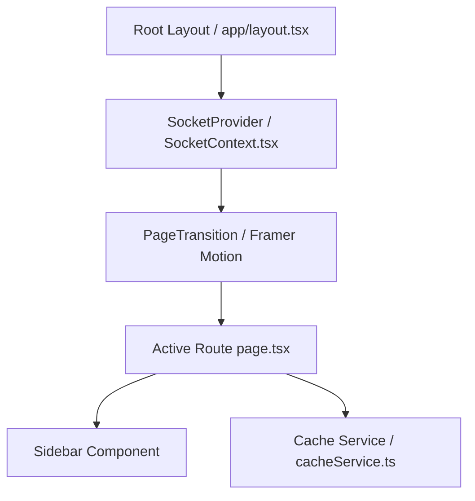

# Frontend Architecture & Next.js Design Pattern

The frontend client of Alumni Hub is built on Next.js 16 (App Router), Tailwind CSS, Framer Motion, and Firebase Client SDK. It uses a **Liquid Glass** custom design system.

---

## 🏛️ Component & Data Architecture



### 1. Root Layout & Socket Provider
- **`app/layout.tsx`**: Embeds the global CSS, font parameters (`Plus_Jakarta_Sans` and `Geist_Mono`), custom cursor trails, and wraps child routing in `SocketProvider`.
- **`SocketProvider`**: Manages real-time Stomp WS connection. Subscribes to user private notification channels on mount, updating the message/notification unread badges dynamically in the Sidebar.

### 2. Client Cache Service
A custom TTL (Time-To-Live) cache resolves double-fetch issues during tab switches. Before sending REST calls, services check `requestCache`:
```typescript
const cachedFeed = requestCache.get("feed_posts");
if (cachedFeed) {
  setPosts(cachedFeed);
  setFeedLoading(false);
  // Fetch fresh posts in the background to update cache
  getMemoriesFeed().then(res => {
    setPosts(res);
    requestCache.set("feed_posts", res, 20000);
  });
}
```

---

## 🎨 Liquid Glass Design System

The visual theme is defined in [globals.css](file:///home/sasikiransrinivas/Projects/AlumniHub/frontend/app/globals.css) and relies on these glassmorphic utility classes:

### 1. Panel Glassmorphism (`.glass-panel`)
- Dark translucent background: `rgba(15, 15, 15, 0.35)`
- Heavy blur filters: `backdrop-filter: blur(25px)`
- Sleek white borders: `1px solid rgba(255, 255, 255, 0.08)`
- Dynamic shadows: `box-shadow: 0 8px 32px 0 rgba(0, 0, 0, 0.4)`

### 2. Inputs & Buttons (`.glass-input`, `.glass-button`)
- Active focus outlines transition border opacity from `0.06` to `0.25` using smooth cubic-beziers.
- Hover animations scale elements slightly (`whileHover={{ scale: 1.02 }}`) to enhance user feedback.
