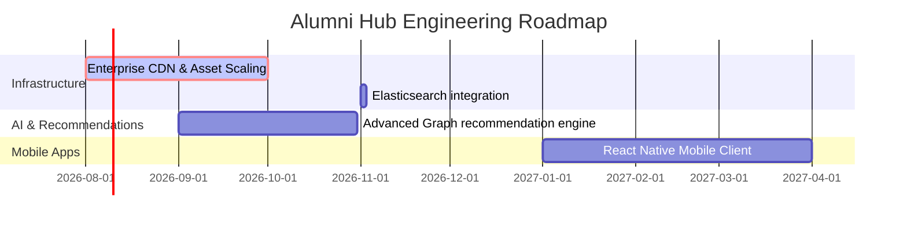

# Future Development Roadmap

This document outlines the strategic vision and upcoming milestones for Alumni Hub after the v3.0 stable release.

---

## 📅 Roadmap Overview

---

## 📍 Phase 4: Scalability & Enterprise Infrastructure

### 1. Elasticsearch Integration for Directory Queries
- **Objective**: As the database grows to hundreds of thousands of entries, relocate directory queries from database wildcard `LIKE` predicates to a dedicated Elasticsearch cluster.
- **Features**: Support fuzzy search, typo tolerance, spelling auto-correction, and synonym parsing.

### 2. Multi-Region Database Replica Tuning
- **Objective**: Minimize connection latency for international alumni.
- **Features**: Run Read-Replicas of PostgreSQL in regional data centers (Europe, US West, Asia-Pacific) using AWS Aurora global databases or Heroku multi-region clusters.

---

## 📍 Phase 5: Smart Networks & AI Recommendations

### 1. Neural Network Candidate Matching (Referrals & Jobs)
- **Objective**: Match jobs to the most qualified alumni profiles.
- **Features**: Vector embeddings using OpenAI `text-embedding-3-small` stored in pgvector. Rank candidate profiles automatically against job descriptions.

### 2. Mentorship Goal Tracking
- **Objective**: Expand the Mentorship module.
- **Features**: Add chat goal settings, milestones, file attachments for resume reviews, and calendar integrations (Google Calendar, Outlook).

---

## 📍 Phase 6: Mobile Client Apps

### 1. Cross-Platform Native Apps
- **Objective**: Build mobile clients for iOS and Android.
- **Technology**: React Native, sharing services, utility hooks, and types with the Next.js frontend codebase.
- **Features**: Direct device push notifications (APNs, FCM) and quick-share widgets for posting memories.
