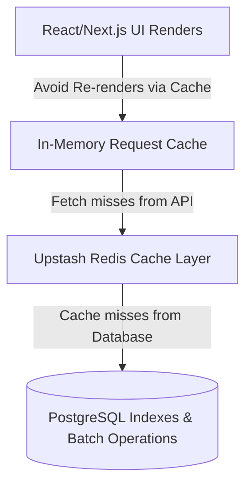

# Performance Optimization & Caching Strategy

Alumni Hub employs key optimizations across frontend client renders, API routing caches, database queries, and batch operations.

---

## 🏛️ Optimization Layer Model



---

## 🚀 Key Performance Implementation Areas

### 1. Database Indexing
Specific indexes prevent full-table scans during database lookup and ordering queries:
- **Unique Constraints**: Unique indexes on `users(email)` and `users(firebase_uid)`.
- **Directory composite**: Index on `(batch, department, section)` for classmate lookups.
- **Message list**: Composite index on `(conversation_id, created_at DESC)` ensures message history queries scale.
- **Alert list**: Index on `(recipient_id, created_at DESC)` optimizes notification checks.
- **Post comments**: Index on `(post_id, created_at DESC)`.

### 2. Eliminating SQL Write Storms
Instead of updating matching directory entities one-by-one inside a loop, `AlumniService` utilizes bulk JPQL updates. For instance, search appearance telemetry is recorded in a single statement:
```java
entityManager.createQuery(
  "UPDATE User u SET u.searchAppearances = COALESCE(u.searchAppearances, 0) + 1 WHERE u.id IN :ids"
).setParameter("ids", resultIds).executeUpdate();
```

### 3. Frontend Client-Side Request Cache
A utility (`CacheService` inside `cacheService.ts`) acts as an in-memory TTL cache for the client layer, bypassing redundant HTTP fetches during dashboard navigation:
- **`feed_posts`**: Caches memories feed.
- **`conversations_list`**: Caches chat rooms.
- **`dir_search_*`**: Caches classmate directory search lookups.
- TTL limits range from 15 to 30 seconds to balance freshness and speed.
