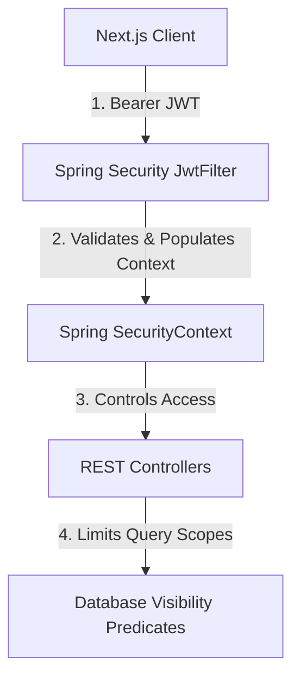

# Security Architecture & Data Protection

Security is deeply integrated into every layer of Alumni Hub, combining cryptographic token verification, fine-grained database visibility predicates, and validation of upload payloads.

---

## 🔒 Security Design Layout

---

## 🛡️ Critical Controls

### 1. Firebase Token Decoupling
Alumni Hub does not allow client-supplied profile information to register user accounts. Registrations only occur when the server verifies a signed Firebase ID token (`verifyIdToken()`) and extracts the verified email address directly from the claims.

### 2. Spring Security context
All APIs are closed by default:
- Token-less requests are immediately blocked by the security filter chain.
- Authorized users are mapped into a custom `SecurityContextHolder` matching their custom JWT.
- Specific resources are restricted by checking user ID claims (e.g. users can only delete posts or messages they created).

### 3. Dynamic Profile Privacy
User profile fields (phone, email, bio) are dynamically sanitized based on the target user's `privacyLevel`:
- **`PUBLIC`**: All fields (excluding phone) are visible.
- **`ACADEMIC`**: Fields are only visible to alumni belonging to the same admission batch, department, and section.
- **`IN_TOUCH_ONLY`**: Fields are only visible once an `InTouchConnection` is explicitly created and set to `ACCEPTED`.
- **Contact Request Authorization**: Phone numbers are strictly hidden unless a direct `ContactRequest` is created and marked as `ACCEPTED` by the profile owner.
- Predicates are computed server-side in `AlumniService` before DTO mappings are compiled.

### 4. File Upload Protections
All profile media, post attachments, and resumes are pushed to secure Cloudinary buckets.
- Upload endpoints perform file type signature verifications.
- Files must fall within size constraints (e.g. image constraints) to block server exhaustion.
