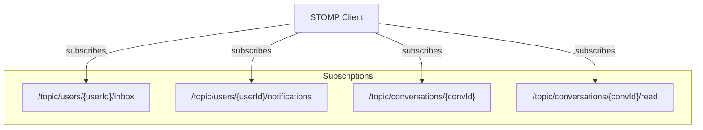

# WebSocket & STOMP Protocol Communication

Alumni Hub utilizes real-time WebSocket communication using **STOMP (Simple Text Oriented Messaging Protocol)** to drive instant messaging delivery, read receipts, typing notifications, and system notifications.

---

## 🔌 Connection Setup

* **WebSocket Gateway Endpoint**: `ws://<domain>/ws-chat/websocket` (or secure `wss://`)
* **Handshake Protocol**: STOMP over WebSocket
* **Authentication**: Handshake request headers must include the application JWT in the `Authorization` claim:
  `Authorization: Bearer <JWT_token>`

---

## 📈 Topic Subscription Patterns

Clients subscribe to the following destination pathways to receive real-time updates:

### 1. Conversation Message Room
* **Topic URL**: `/topic/conversations/{conversationId}`
* **Payload**: `MessageDto` (JSON)
* **Description**: Real-time incoming chat bubbles dispatched to active conversation participants.

### 2. Room Read Acknowledgement
* **Topic URL**: `/topic/conversations/{conversationId}/read`
* **Payload**: `true` (Boolean)
* **Description**: Dispatched when a participant marks the conversation as read. Clears unread indicators immediately.

### 3. User Private Inbox Updates
* **Topic URL**: `/topic/users/{userId}/inbox`
* **Payload**: `ConversationDto` (JSON)
* **Description**: Delivers real-time badge updates and last message details to re-order the conversation pane list.

### 4. Alerts & Notifications
* **Topic URL**: `/topic/users/{userId}/notifications`
* **Payload**: `NotificationDto` (JSON)
* **Description**: Delivers likes, comments, connections, or contact requests real-time system alerts.
